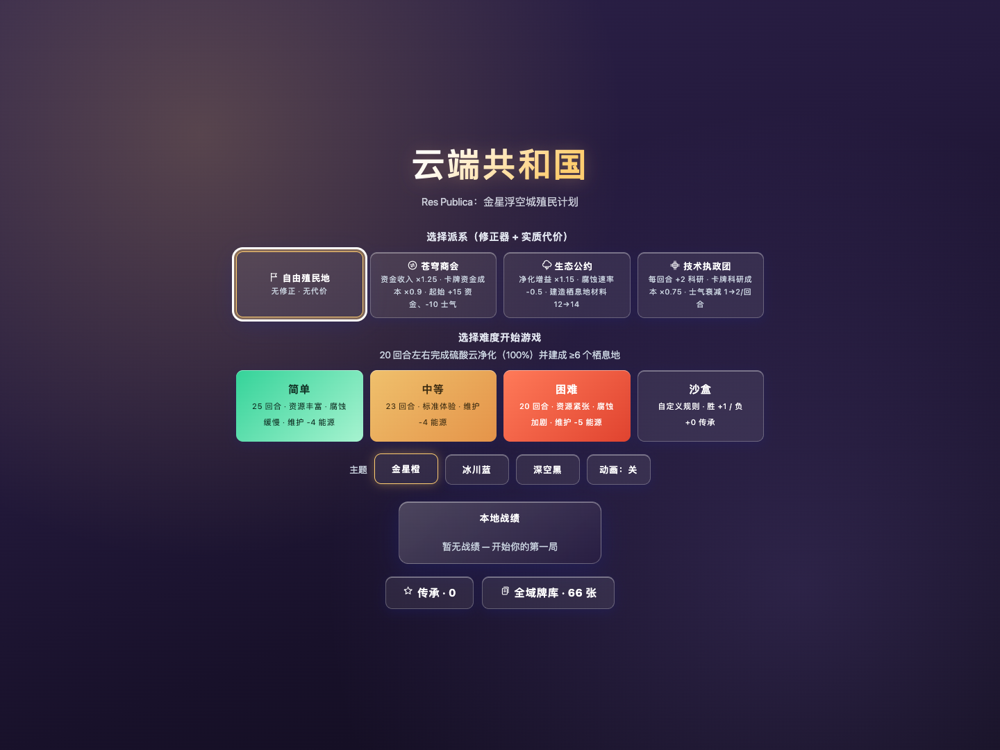
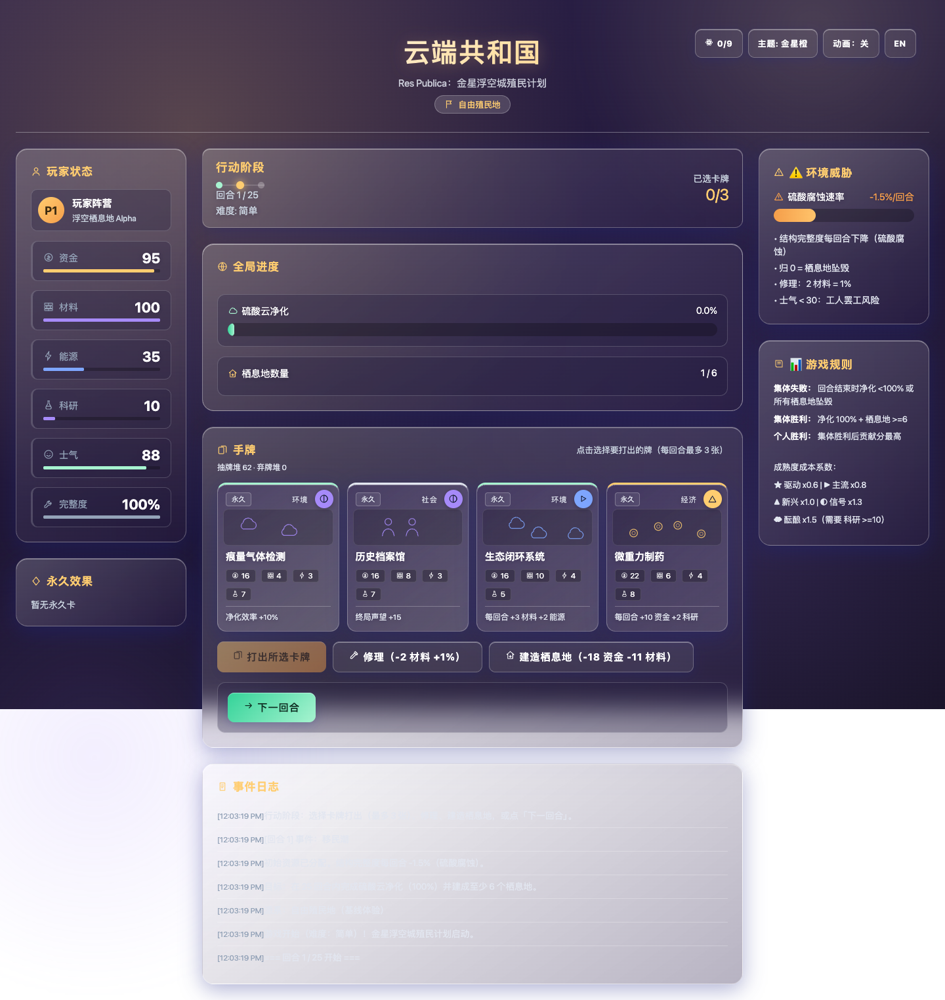
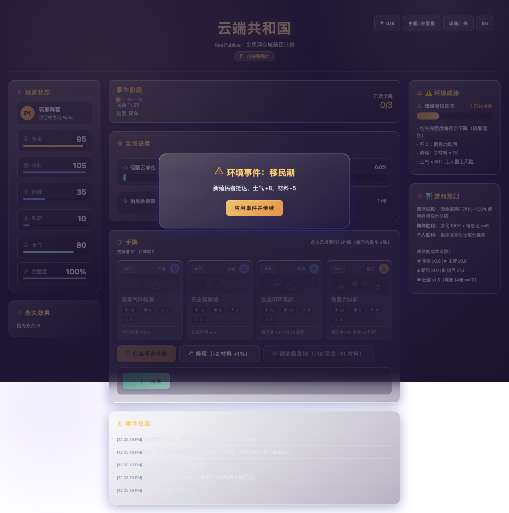

# Cloud Republic: Venus Floating City

[](https://github.com/jiangfengyuan/Cloud-Republica/actions/workflows/ci.yml)
[](LICENSE)

A browser-based, single-player card strategy game about establishing a floating city in Venus's sulfuric-acid clouds. Make the air breathable, protect the platform, and build at least six habitats before time runs out.

**[Play online](https://jiangfengyuan.github.io/Cloud-Republica/)** · **[Read the Chinese introduction](#中文介绍)** · **[Contributing](CONTRIBUTING.md)**

> **Licence and assets.** The source code and original game content in this repository are available under the [MIT License](LICENSE), copyright © 2026 Hayden Jiang. Every image committed to this repository must have a documented, redistributable licence. Third-party design-reference images were audited and removed before publication; the screenshots below are rendered directly by this project.

## Screenshots

| Start screen | Action board |
| --- | --- |
|  |  |

| Environmental event |
| --- |
|  |

## Features

- 66 cards, 20 environmental events, three difficulties, and a sandbox mode.
- Deck building, factions, meta-progression, and a nine-node technology tree.
- Chinese and English UI, three visual themes, deterministic replay support, and versioned local saves.
- Works offline: open `index.html` directly, or build a portable `dist/index.html` release.

## Play

Choose Easy, Medium, or Hard on the start screen. Every turn, reveal an environmental event, then freely play up to three cards, repair the platform, build habitats, and advance to settlement. Win by reaching 100% purification and at least six habitats before the final turn; integrity reaching zero causes a crash.

| Difficulty | Turns | Corrosion / turn | Maintenance | Greedy-bot win rate (500 runs) |
| --- | ---: | ---: | ---: | ---: |
| Easy | 25 | -1.5% | -4 energy | ~86% |
| Medium | 23 | -2% | -4 energy | ~64% |
| Hard | 20 | -2.5% | -5 energy | ~33% |

## Development

```bash
npm install
npm run check
```

`npm run check` runs TypeScript checks, legacy-regression baselines, domain and migration tests, and the offline build. Run `npm run test:e2e` for browser visual baselines (install Playwright Chromium first, if needed).

The current release is intentionally dual-track: `js/` remains the production browser implementation, while `src/` is a TypeScript domain core that will take over only after behaviour-parity checks pass. See [architecture notes](docs/architecture.md), the [baseline](docs/refactor/baseline.md), and the [migration roadmap](docs/refactor/roadmap.md).

## 中文介绍

《Cloud Republic: Venus Floating City》是一款单人卡牌策略游戏：你需要在有限回合内净化金星硫酸云、维持浮空平台完整度，并建成至少 6 个栖息地。

项目包含 66 张卡牌、20 个环境事件、三档难度、沙盒、自定义牌库、阵营、局外传承、9 节点科技树、中英双语和三套主题。对局会自动保存，可在刷新后继续。

### 游玩方式

可直接双击 `index.html` 离线游玩，或访问上方的在线试玩地址。每回合先揭示环境事件，再自由安排打牌（最多 3 张）、修理、建造栖息地与结算。最终回合前达到净化 100% 且栖息地不少于 6 个即可获胜。

### 开发与贡献

运行 `npm run check` 可完成类型检查、规则/存档回归、新领域测试和离线构建。当前处于“旧 JavaScript 生产实现 + 新 TypeScript 领域内核”的双轨重构期；贡献规范见 [CONTRIBUTING.md](CONTRIBUTING.md)。

### 授权与素材

仓库中的源代码与原创游戏内容采用 [MIT License](LICENSE)，版权所有 © 2026 Hayden Jiang。所有提交的图片都必须附带可再分发授权依据；此前无授权的第三方设计参考图已完成审计并从历史中移除，README 截图均由本项目自行渲染。
